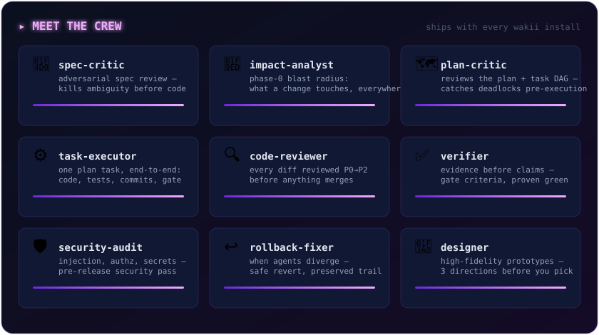
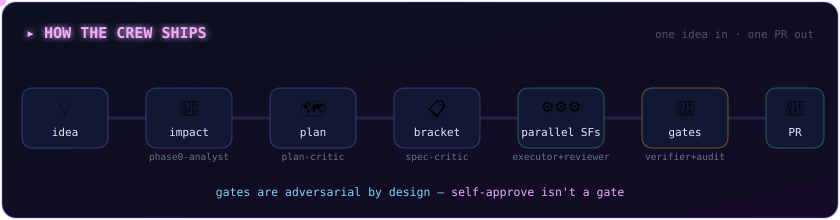
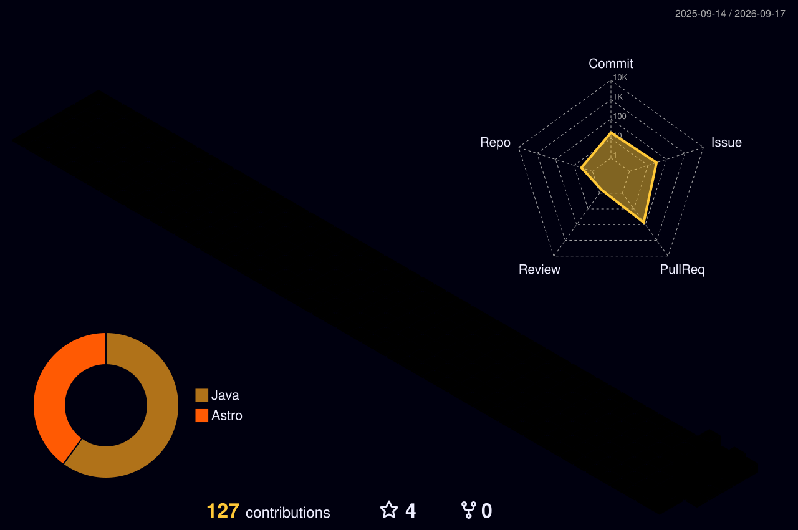

  

  

  🌐 <a href="https://wakii.dev"><b>wakii.dev</b></a> · <a href="https://github.com/wakii-dev/wakii-site">wakii-site</a> · <a href="https://github.com/wakii-dev/hub-store">hub-store</a>

---

## 🖥️ How I ship

|  | **Human × AI agents** — specs and judgment from me, execution at agent speed (Claude, Kiro).  Every project here — including the 2.5M-order logistics platform — was built in this loop: **spec → plan → parallel agents → review → ship.** |
| -------------------------------------------------------------------- | ----------------------------------------------------------------------------------------------------------------------------------------------------------------------------------------------------------------------------------------------- |

## 🤖 The agent crew (my contributors)

  

*9 agents ship with every Wakii install. The site, the IDE docs and the
2.5M-order platform below were all reviewed by this crew.*

## ⚙️ The pipeline

  

## 🚀 What I'm building

### ⚡ [Wakii](https://wakii.dev) — agentic IDE
> The IDE where the team comes built-in: a superpowers crew of agents that
> runs brainstorming → specs → plans → parallel execution → review.

- Official site: [wakii.dev](https://wakii.dev) · [`wakii-site`](https://github.com/wakii-dev/wakii-site)
- Docs, skills catalog (20 built-in skills), public roadmap & downloads

### 🏗️ [hub-store](https://github.com/wakii-dev/hub-store) — fulfillment operations platform
> Production-grade logistics platform exercised at **2.5M+ orders / year scale**:
> order coordination, warehouse picking batches, D2C carrier hand-off,
> technician dispatch, COD settlement, label printing.

- Polyglot microservices: **Java 17 / Spring Boot · Go · Python** over gRPC
- **React 18 microfrontends** (Module Federation) behind a Fastify BFF
- PostgreSQL (dual-DB), Kafka side-channel, Keycloak OIDC, pnpm + Turborepo
- Full QA story: role-matrix regression suites, Playwright e2e, CI on Actions

## 🧰 Stack I work with

## 📊 Mission control

  

## 🧊 Contributions in 3D

  

## 🐍 Snake

  <picture>
    <source media="(prefers-color-scheme: dark)" srcset="https://raw.githubusercontent.com/wakii-dev/wakii-dev/output/github-snake-dark.svg" />
    <source media="(prefers-color-scheme: light)" srcset="https://raw.githubusercontent.com/wakii-dev/wakii-dev/output/github-snake.svg" />
    
  </picture>

---

  

<i>Building in public, one agent-crew sprint at a time. 🤖</i>

